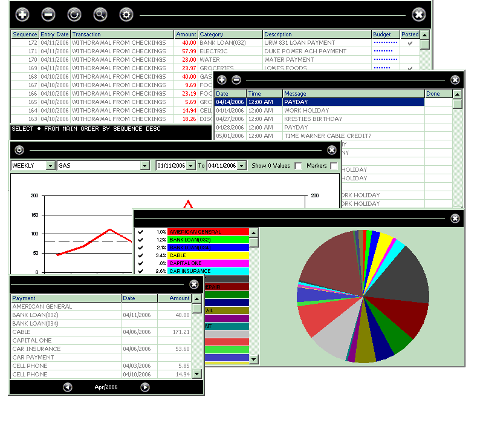

## Money Watcher v1

### Description

This complete application serves as an interface for a MS Access table to help manage various aspects of personal accounting (ie: checkings/savings/bills/ect). Several unique capabilities which include syncing with MS Outlook calendar (for reminders), spending trend/history graphs, budget tracker, payment tracker, and more. See the help section if you have questions.
 
### More Info
 

             |
---                |---
**Submitted On**   |2006-04-11 21:12:52
**By**             |[n8\-the\-gr8](https://github.com/Planet-Source-Code/PSCIndex/blob/master/ByAuthor/n8-the-gr8.md)
**Level**          |Intermediate
**User Rating**    |4.6 (46 globes from 10 users)
**Compatibility**  |VB 5\.0, VB 6\.0
**Category**       |[Complete Applications](https://github.com/Planet-Source-Code/PSCIndex/blob/master/ByCategory/complete-applications__1-27.md)
**World**          |[Visual Basic](https://github.com/Planet-Source-Code/PSCIndex/blob/master/ByWorld/visual-basic.md)
**Archive File**   |[Money\_Watc1986424112006\.zip](https://github.com/Planet-Source-Code/n8-the-gr8-money-watcher-v1__1-64984/archive/master.zip)

